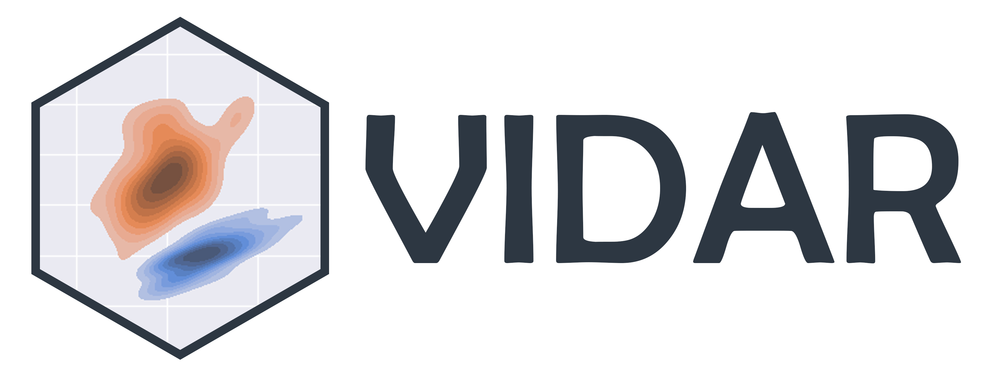

#Checking again


# VIDAR: Visualization Interface for Data Analytics and Reduction

Welcome to **VIDAR** (*pronounced as /ˈviː.dɑːr/*).

## 🚀 Project Summary

This project aims to develop a Python package to create **interactive data applications for low-dimensional data visualization derived from dimension reduction methods and clustering algorithms**. The focus will be on scientific plotting, interactive widgets, and event handling. This tool will enable researchers to intuitively explore and interpret complex data sets, enhancing understanding and discovery in various scientific fields. The package will be designed for ease of use, allowing even those with limited programming experience to effectively engage with their data. It will support common formats and integrate smoothly with existing data analysis workflows.

## 🛠️ Installation

```bash
pip install git+https://github.com/jiadongdan/VIDAR.git
```

## 📁 Repository Structure

```plaintext
├── colors
├── clustering
├── interactive
├── utils
├── data
├── submodule6
└── submodule7
```
## 💻 Developers

<table>
  <tbody>
    <tr>
      <td align="center" valign="top" width="14.28%"><a href="https://github.com/ccalvotusell"><br /><a href="https://github.com/ccalvotusell" title="Code">Carla Calvo-Tusell</a></td>
      <td align="center" valign="top" width="14.28%"><a href="https://github.com/elnazazizi"><br /><a href="https://github.com/elnazazizi" title="Code">Elnaz Azizi</a></td>
      <td align="center" valign="top" width="14.28%"><a href="https://github.com/IndrajitWadgaonkar"><br /><a href="https://github.com/IndrajitWadgaonkar" title="Code">Indrajit Wadgaonkar</a></td>
      <td align="center" valign="top" width="14.28%"><a href="https://github.com/jiadongdan"><br /><a href="https://github.com/jiadongdan" title="Code">Jiadong Dan</a></td>
      <td align="center" valign="top" width="14.28%"><a href="https://github.com/klai001"><br /><a href="https://github.com/klai001" title="Code">Kei Onn Lai</a></td>
      <td align="center" valign="top" width="14.28%"><a href="https://github.com/jiadongdan/longyangking"><br /><a href="https://github.com/longyangking" title="Code">Yang Long</a></td>
    </tr>
  </tbody>
</table>

## Acknowledgment

We extend our heartfelt thanks to Schmidt Futures and the Oxford Doctoral Training Center for their indispensable support of the VIDAR project. Schmidt Futures generously funded our crucial in-person meeting in Oxford, fostering significant collaboration among team members, while the Oxford Doctoral Training Center provided invaluable technical support and organized workshops that propelled our project forward. We deeply appreciate their contributions, which have been vital to our success.

